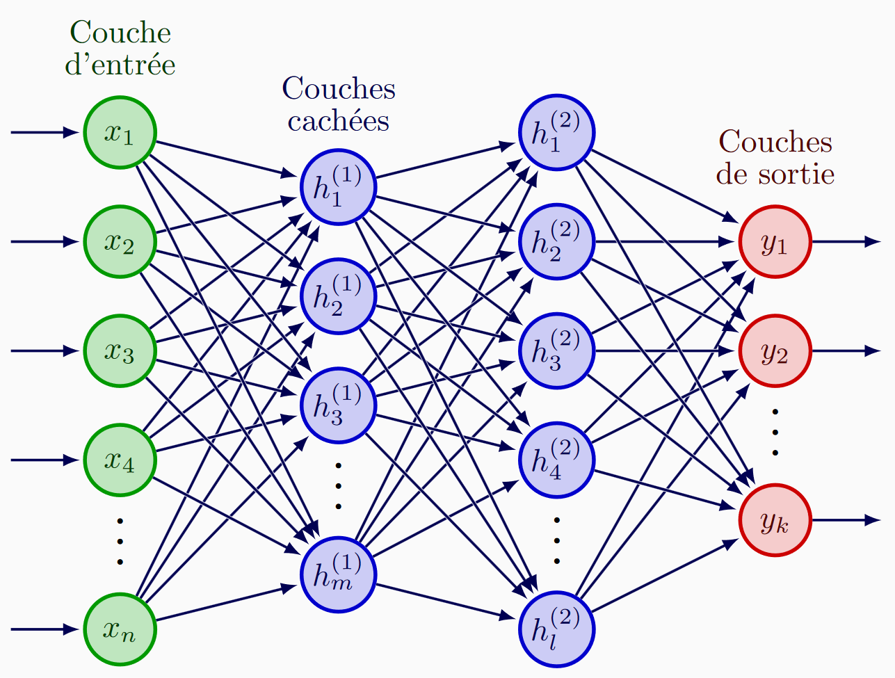

# Neural-network-library
a library that I made to generate and train a fully connected neural network like this one.
<p align="center">
  
</p>

# Features
*  Define a custom network architecture with any number of hidden layers (or none).
*  Basic activation functions: Sigmoid, ReLU, and Tanh
*  Adjustable learning rate
*  Fully written in Python and Numpy, no external ML libraries required.

# Requirements
* Python 3.8+
* Numpy

# Installation & Setup

**1. Clone the repository:**

   ```Bash
   git clone https://github.com/laios1/Neural-network-library.git
   cd Neural-network-library
   ```
**2. Create and activate a virtual environment:**

  ### On macOS/Linux:
  ```bash
  python3 -m venv venv
  source venv/bin/activate
  ```
  ### On Windows:
  ```Bash
  python -m venv venv
  venv\Scripts\activate
  ```

**3. install dependencies**

  ```Bash
  pip install numpy
  ```

# Getting Started
## Create a Neural Network
```python
import Neural_Network as nn 

# Define the architecture:
# Format: [input_size, hidden1_size, ..., output_size]
network_sizes = [2,3,2] #here : 2 inputs, 1 hidden layer with 3 neurons, 2 outputs

# Activation function (optional, default = "sigmoid")
# Options: "sigmoid", "relu", "tanh"
activation_function = "relu"

# Learning rate (optional, default = 0.1)
lr = 0.1 

network = nn.neural_network(network_sizes, LR=lr,act=activation_function)
```
